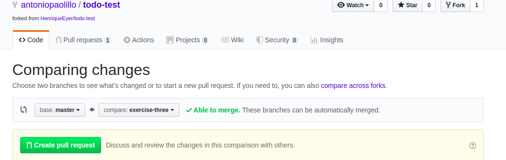

Esse é um exercício para o conteúdo de `React Testing Library`.

### Antes de iniciar

Crie um fork desse projeto e para isso siga esse [tutorial de como realizar um fork](https://guides.github.com/activities/forking/).

Após feito o fork, clone o repositório criado para o seu computador.

Rode o `npm install`.

Vá para a branch master do seu projeto e execute o comando:

`git branch`

Mude para uma branch `portfolio-web` com o comando `git checkout -b portfolio-web`. É nessa branch que você realizará a solução para o exercício.

Observe o que deve ser feito nas instruções abaixo.

Após a solução dos exercícios, abra um PR no seu repositório forkado e, se quiser, mergeie para a master, sinta-se a vontade!

**Atenção!** Quando for criar o PR você irá se deparar com essa tela:

É necessário realizar uma mudança. Clique no *base repository* como na imagem abaixo:

Mude para o seu repositório. Seu nome estará na frente do nome dele, por exemplo: `antonio/exercise-portfolio-web`. Depois desse passo a página deve ficar assim:

Agora basta criar o PULL REQUEST clicando no botão `Create Pull Request`.

Para cada PR realize esse processo.

### O QUE SERÁ FEITO?

Lembra de quando montamos um portfólio usando CSS, JS e HTML lá no começo do curso, no dia [3.1](https://app.betrybe.com/course/fundamentals/html-css/html-css-part-1)? Dessa vez faremos o mesmo exercício, porém agora usando o React e o deixaremos mais atrativo para pessoas recrutadoras ao mostrar que também sabemos programar testes automatizados :heart:

### COMEÇANDO OS EXERCÍCIOS

À primeira vista, pode parecer uma tarefa gigante construir o próprio Portfólio com React e testes. Então, para ajudar, vamos sugerir uma sequência do que fazer, passo a passo, para que você possa seguir com mais confiança:

* Comece construindo as rotas com _React Router_ e os componentes base (que são componentes sem as funcionalidades completas, apenas com um texto pequeno dentro para renderizarem na tela), e após isso teste tudo. Exemplos de rotas para seu portfólio seriam: `Início`, `Projetos`, `Sobre mim` e `Contato`.

  * Teste que o clique em cada rota renderiza os textos esperados na tela.
  * Teste com o histórico que as urls corretas são acessadas após cada clique.
  * Teste que, ao clicar num componente, o texto do componente que estava renderizado some da tela!

* Daqui em diante, para cada um dos itens abaixo, você deve escrever os testes antes de ir para o próximo. **É muito importante testar a sua aplicação aos poucos, ao longo do desenvolvimento.** Você pode fazer a funcionalidade dos itens primeiro e depois testar. Ou, você pode, também, fazer TDD, escrevendo os testes primeiro e depois a funcionalidade do item, que é necessária para passar nos testes. A escolha é sua, ok?

### Escolha três itens para incluir no seu portfólio, e inclua os demais como bônus:

* Seu nome completo e uma foto atual sua, onde o texto alternativo deve ser a descrição da foto que você está exibindo;

  * Teste o nome normalmente e, na imagem, não esqueça de verificar o `src` e o `alt`

* Uma breve descrição sobre você, destacando algumas informações como nacionalidade e a cidade/estado onde mora;

* Uma lista de habilidades que você possui e destacar a que você mais se orgulha;

  * Para testar o destaque, você poderá usar a classe dele ou o tipo de tag que usou. Caso existam mais elementos com a mesma `classe` ou `tag`, você poderá usar o `datatest-id` para certificar que o elemento é o correto.

* Um link externo para o seu github, que abra em uma nova aba;

  * Teste se o link realmente direciona para a sua página do github. Importante buscar elementos na página que alteram pouco, como o seu próprio `nome` ou `apelido`.

  * Utilize _mocks_ para testes em links externos.

* Um índice com links internos para as diferentes seções do seu portfólio, agora separadas por páginas, utilizando _React Router_.

  * Teste cada um separadamente, não se esqueça de usar o `history` para reiniciar o estado de cada teste.

* Um formulário com campo de e-mail e mensagem para que as pessoas possam entrar em contato com você [EmailJS](href="https://www.emailjs.com/docs/introduction/how-does-emailjs-work/).

  * Utilize _mocks_ para garantir o funcionamento desse teste, uma vez que essa aplicação comporta-se como uma API e é um link externo. 

### Dicas gerais para os testes:

  * Comece seus testes por algum elemento fixo e bem previsível na tela inicial, um título por exemplo é o ideal, pois assim você já verifica se seus testes estão funcionando devidamente.
  
  * Verifique antes de tudo se o elemento a ser testado existe, depois verifique seu conteúdo e por fim, verifique suas funcionalidades (caso existam).

  * Faça um describe para organizar o conjunto de testes e mantenha os nomes dos `its` ou `tests` sempre coerente sobre o que está sendo testado.

  * Use _mocks_ para o envio de e-mail, testes de rotas e de formulários.

Divirta-se codando! :rocket:
